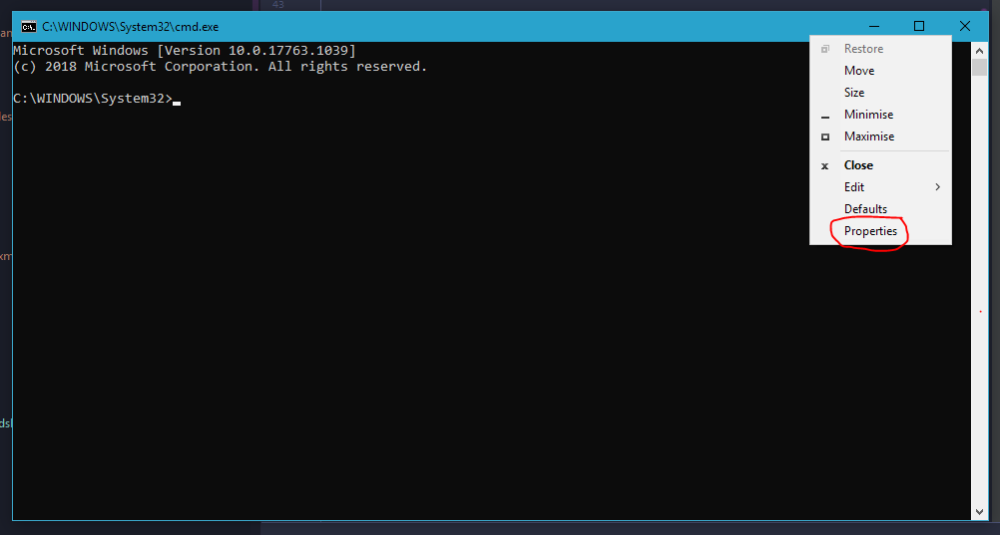
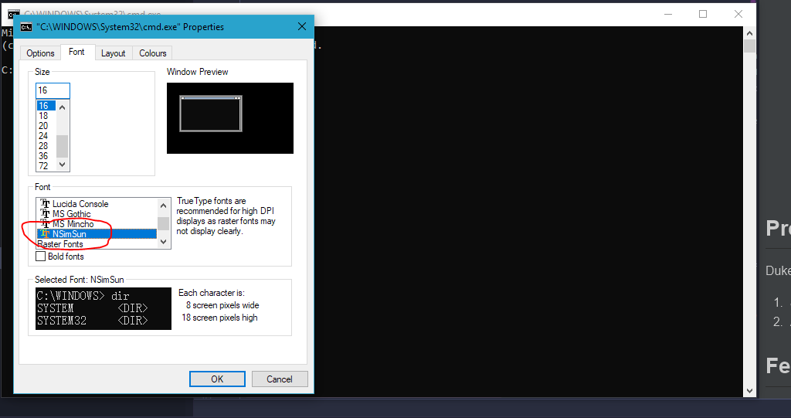
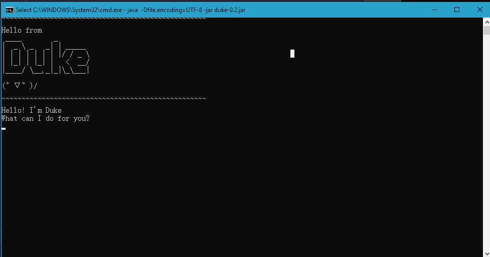

# User Guide For Duke

# Table of content
<!-- TOC -->
- [Introduction](#introduction)
- [Prerequisites](#prerequisites)
- [Features](#features)
    - [Add task](#add-task)
    - [List task](#list-task)
    - [Delete task](#delete-task)
    - [Find task](#find-task)
    - [Mark task as done](#mark-task-as-done)
    - [Exit Duke](#exit-duke)
- [Usage](#usage)
    - [`todo [description]` - Adds a **TODO** task into Duke](#todo-description---adds-a-todo-task-into-duke)
    - [`event [description] /[slash word] [yyyy-mm-dd]` - Adds an **EVENT** task into Duke](#event-description-slash-word-yyyy-mm-dd---adds-an-event-task-into-duke)
    - [`deadline [description] /[slash word] [yyyy-mm-dd]` - Adds a **DEADLINE** task into Duke](#deadline-description-slash-word-yyyy-mm-dd---adds-a-deadline-task-into-duke)
    - [`list` - List all the tasks stored by duke](#list---list-all-the-tasks-stored-by-duke)
    - [`delete [tasknumber in list]` - Delete a task in duke by the list's task number](#delete-tasknumber-in-list---delete-a-task-in-duke-by-the-lists-task-number)
    - [`find [keyword or sentence]` - Find a task based on the keyword or the sentence given](#find-keyword-or-sentence---find-a-task-based-on-the-keyword-or-the-sentence-given)
    - [`done [tasknumber in list]` - Mark a task as done in duke by the list's task number](#done-tasknumber-in-list---mark-a-task-as-done-in-duke-by-the-lists-task-number)
    - [Other errors](#other-errors)
    - [`bye` - exit Duke](#bye---exit-duke)
<!-- /TOC -->

## Introduction

```
~~~~~~~~~~~~~~~~~~~~~~~~~~~~~~~~~~~~~~~~~~~~~~~~~~~
Hello from
 ____        _        
|  _ \ _   _| | _____ 
| | | | | | | |/ / _ \
| |_| | |_| |   <  __/
|____/ \__,_|_|\_\___|

(°▽°)/

~~~~~~~~~~~~~~~~~~~~~~~~~~~~~~~~~~~~~~~~~~~~~~~~~~~
Hello! I'm Duke
What can I do for you?
```

Duke is a personal chatbot that helps the user to store tasks such as todos, events and deadlines. Not only is it
 able to store tasks, Duke has the ability to find tasks and also to mark tasks as done. In addition, Duke can delete
  and remove any task that the user chooses. Duke also has the ability to save the list of tasks offline upon Duke exit and can load back the tasks again when Duke restarts.

When Duke starts, it loads the list of tasks from `data\duke.txt` if it exist. Likewise, upon exit, it save the task
 into `data\duke.txt` too.
 
Duke uses UTF-8 unicode characters, which some command prompt might not support.

- If your command prompt supports UTF-8 natively, to run duke, type this into command prompt

`$ java -jar duke-0.2.jar`

- If your command prompt does not support UTF-8 natively, you could try the following method (for windows user):
    1. Right click on the title bar of the command prompt and click on `properties`
    
    2. Under `Font`, choose `NSimSun`  (by default, Window's command prompt font is `Consolas`).
    
    3. After which, click `Ok`. The command prompt should look like this now:
    
    4. Once this is done, run duke using this command in command prompt instead:

`$ java -Dfile.encoding=UTF-8 -jar duke-0.2.jar`.
    
If all goes well, you should see this in command prompt:


   
    
## Prerequisites
Duke's system requirements
1. JDK 11
2. Able to output unicode characters in command prompt


## Features

### Add task 
Adds a **TODO**, **EVENT** or a **DEADLINE** task

### List task
List all the tasks that Duke have currently

### Delete task
Delete a task by its task number 

### Find task
Find tasks that corresponds to the keywords used

### Mark task as done
Mark a task as done

### Exit Duke
Exit duke and save the task into an offline data file (in `/data/duke.txt`)

## Usage

### `todo [description]` - Adds a **TODO** task into Duke

Duke supports **TODO** tasks. In a **TODO** task, it contains:
1. the `todo` keyword
2. the task (the `description`) of the **TODO** task

Format: `todo [description]`

#### Example of usage: 
- `todo eat noodles`

##### Expected outcome:

```
~~~~~~~~~~~~~~~~~~~~~~~~~~~~~~~~~~~~~~~~~~~~~~~~~~~
(ﾉ´ヮ`)ﾉ *:ﾟ 

Got it. I've added this task: [T][✘] eat noodles 
~~~~~~~~~~~~~~~~~~~~~~~~~~~~~~~~~~~~~~~~~~~~~~~~~~~
What else do you want to do?
```

#### Example of wrong usage (missing description): 
- `todo`

##### Expected error outcome:
```
~~~~~~~~~~~~~~~~~~~~~~~~~~~~~~~~~~~~~~~~~~~~~~~~~~~
(」°ロ°)」

Exception occurred: duke.exception.MissingDescriptionException: Missing description!
~~~~~~~~~~~~~~~~~~~~~~~~~~~~~~~~~~~~~~~~~~~~~~~~~~~
What else do you want to do?
```

### `event [description] /[slash word] [yyyy-mm-dd]` - Adds an **EVENT** task into Duke

Duke supports **EVENT** tasks. In a **EVENT** task, it contains:
1. the `event` keyword
2. the task (the `description`) of the **EVENT** task
3. the slash word (only accepted slash words are `at` and `on`)
4. the date (in the `yyyy-mm-dd` format) 

Format: `event [description] /[slash word] [yyyy-mm-dd]`

#### Example of usage: 
- `event meet friends /at 2020-12-12`

##### Expected outcome:
```
~~~~~~~~~~~~~~~~~~~~~~~~~~~~~~~~~~~~~~~~~~~~~~~~~~~
(ﾉ´ヮ`)ﾉ *:ﾟ 

Got it. I've added this task: [E][✘] meet friends (at: Dec 12 2020)
~~~~~~~~~~~~~~~~~~~~~~~~~~~~~~~~~~~~~~~~~~~~~~~~~~~
What else do you want to do?
```

#### Example of usage: 
- `event group project /on 2020-12-13`

##### Expected outcome:
```
~~~~~~~~~~~~~~~~~~~~~~~~~~~~~~~~~~~~~~~~~~~~~~~~~~~
(ﾉ´ヮ`)ﾉ *:ﾟ 

Got it. I've added this task: [E][✘] group project (on: Dec 13 2020)
~~~~~~~~~~~~~~~~~~~~~~~~~~~~~~~~~~~~~~~~~~~~~~~~~~~
What else do you want to do?
```

#### Example of wrong usage (missing description): 

- `event`

##### Expected error outcome:
```
~~~~~~~~~~~~~~~~~~~~~~~~~~~~~~~~~~~~~~~~~~~~~~~~~~~
(」°ロ°)」

Exception occurred: duke.exception.MissingDescriptionException: Missing description!
~~~~~~~~~~~~~~~~~~~~~~~~~~~~~~~~~~~~~~~~~~~~~~~~~~~
What else do you want to do?
```

#### Example of wrong usage (missing slash word): 

- `event sports meeting`
- `event sports meeting /`
- `event sports meeting / at`

##### Expected error outcome:
```
~~~~~~~~~~~~~~~~~~~~~~~~~~~~~~~~~~~~~~~~~~~~~~~~~~~
(」°ロ°)」

Exception occurred: duke.exception.MissingSlashWordException: Missing slash word!
~~~~~~~~~~~~~~~~~~~~~~~~~~~~~~~~~~~~~~~~~~~~~~~~~~~
What else do you want to do?
```

#### Example of wrong usage (wrong slash word): 

- `event sports meeting /through`
- `event sports meeting /like 2012-01-01`

##### Expected error outcome:
```
~~~~~~~~~~~~~~~~~~~~~~~~~~~~~~~~~~~~~~~~~~~~~~~~~~~
(」°ロ°)」

Exception occurred: duke.exception.WrongSlashWordException: Wrong slash word!
for EVENT: the slash word can only be 'at' or 'on'
for DEADLINE: the slash word can only be 'by' 
~~~~~~~~~~~~~~~~~~~~~~~~~~~~~~~~~~~~~~~~~~~~~~~~~~~
What else do you want to do?
```

#### Example of wrong usage (missing date): 

- `event sports meeting /on `

##### Expected error outcome:

```
~~~~~~~~~~~~~~~~~~~~~~~~~~~~~~~~~~~~~~~~~~~~~~~~~~~
(」°ロ°)」

Exception occurred: duke.exception.MissingDateFieldException: Missing date!
~~~~~~~~~~~~~~~~~~~~~~~~~~~~~~~~~~~~~~~~~~~~~~~~~~~
What else do you want to do?
```

#### Example of wrong usage (wrong date format): 

- `event sports meeting /on 12-12-1990`

##### Expected error outcome:

```
~~~~~~~~~~~~~~~~~~~~~~~~~~~~~~~~~~~~~~~~~~~~~~~~~~~
(」°ロ°)」

Exception occurred: java.time.DateTimeException: Date cannot be parsed! Make sure the format is correct! Format: yyyy-mm-dd
~~~~~~~~~~~~~~~~~~~~~~~~~~~~~~~~~~~~~~~~~~~~~~~~~~~
What else do you want to do?
```

### `deadline [description] /[slash word] [yyyy-mm-dd]` - Adds a **DEADLINE** task into Duke

Duke supports **DEADLINE** tasks. In a **DEADLINE** task, it contains:
1. the `deadline` keyword
2. the task (the `description`) of the **DEADLINE** task
3. the slash word (Only accepted slash word is `by`)
4. the date (in the `yyyy-mm-dd` format) 

Format: `deadline [description] /[slash word] [yyyy-mm-dd]`

#### Example of usage: 
`deadline math homework /by 2020-12-12`

##### Expected outcome:
```
~~~~~~~~~~~~~~~~~~~~~~~~~~~~~~~~~~~~~~~~~~~~~~~~~~~
(ﾉ´ヮ`)ﾉ *:ﾟ 

Got it. I've added this task: [D][✘] math homework (by: Dec 12 2020)
~~~~~~~~~~~~~~~~~~~~~~~~~~~~~~~~~~~~~~~~~~~~~~~~~~~
What else do you want to do?
```

#### Example of wrong usage (missing description): 

- `deadline`

##### Expected error outcome:
```
~~~~~~~~~~~~~~~~~~~~~~~~~~~~~~~~~~~~~~~~~~~~~~~~~~~
(」°ロ°)」

Exception occurred: duke.exception.MissingDescriptionException: Missing description!
~~~~~~~~~~~~~~~~~~~~~~~~~~~~~~~~~~~~~~~~~~~~~~~~~~~
What else do you want to do?
```

#### Example of wrong usage (missing slash word): 

- `deadline Math homework`
- `deadline Math homework /`
- `deadline Math homework / by`

##### Expected error outcome:
```
~~~~~~~~~~~~~~~~~~~~~~~~~~~~~~~~~~~~~~~~~~~~~~~~~~~
(」°ロ°)」

Exception occurred: duke.exception.MissingSlashWordException: Missing slash word!
~~~~~~~~~~~~~~~~~~~~~~~~~~~~~~~~~~~~~~~~~~~~~~~~~~~
What else do you want to do?
```

#### Example of wrong usage (wrong slash word): 

- `deadline Math homework /in`
- `deadline Math homework /because 1980-12-12`

##### Expected error outcome:
```
~~~~~~~~~~~~~~~~~~~~~~~~~~~~~~~~~~~~~~~~~~~~~~~~~~~
(」°ロ°)」

Exception occurred: duke.exception.WrongSlashWordException: Wrong slash word!
for EVENT: the slash word can only be 'at' or 'on'
for DEADLINE: the slash word can only be 'by' 
~~~~~~~~~~~~~~~~~~~~~~~~~~~~~~~~~~~~~~~~~~~~~~~~~~~
What else do you want to do?
```

#### Example of wrong usage (missing date): 

- `deadline Math homework /by  `

##### Expected error outcome:

```
~~~~~~~~~~~~~~~~~~~~~~~~~~~~~~~~~~~~~~~~~~~~~~~~~~~
(」°ロ°)」

Exception occurred: duke.exception.MissingDateFieldException: Missing date!
~~~~~~~~~~~~~~~~~~~~~~~~~~~~~~~~~~~~~~~~~~~~~~~~~~~
What else do you want to do?
```

#### Example of wrong usage (wrong date format): 

- `deadline Math homework /by 12-12-1990`

##### Expected error outcome:

```
~~~~~~~~~~~~~~~~~~~~~~~~~~~~~~~~~~~~~~~~~~~~~~~~~~~
(」°ロ°)」

Exception occurred: java.time.DateTimeException: Date cannot be parsed! Make sure the format is correct! Format: yyyy-mm-dd
~~~~~~~~~~~~~~~~~~~~~~~~~~~~~~~~~~~~~~~~~~~~~~~~~~~
What else do you want to do?
```

### `list` - List all the tasks stored by duke

If there is any task stored in Duke, it will display all of them. However, if there is no tasks present, it will report that there is no tasks present

Format: `list`
#### Example of usage: 
- `list`

##### Expected outcome if there are tasks:
```
~~~~~~~~~~~~~~~~~~~~~~~~~~~~~~~~~~~~~~~~~~~~~~~~~~~
(*´▽`*) 

Here is the list of tasks:
1. [T][✓] make list 
2. [D][✓] english homework (by: Nov 14 2020)
3. [T][✓] go polyclinic 
4. [T][✘] go visit friends 
5. [E][✘] group project (at: Sep 14 2020)
6. [E][✘] sports meeting (on: Nov 13 2019)
7. [T][✘] buy chocolate 
~~~~~~~~~~~~~~~~~~~~~~~~~~~~~~~~~~~~~~~~~~~~~~~~~~~
What else do you want to do?
```

##### Expected outcome if there isn't any tasks:
```
~~~~~~~~~~~~~~~~~~~~~~~~~~~~~~~~~~~~~~~~~~~~~~~~~~~
(；￣Д￣) 

Nothing yet
~~~~~~~~~~~~~~~~~~~~~~~~~~~~~~~~~~~~~~~~~~~~~~~~~~~
What else do you want to do?
```

### `delete [tasknumber in list]` - Delete a task in duke by the list's task number

Duke supports the deletion of tasks by its task number in the list. The `delete` command contains:
1. the `delete` keyword
2. the task number (as seen in the list) of task to be deleted 

Format: `delete [tasknumber in list]`

Given this list:
```
1. [T][✓] make list 
2. [D][✓] english homework (by: Nov 14 2020)
3. [T][✓] go polyclinic 
4. [T][✘] go visit friends 
5. [E][✘] group project (at: Sep 14 2020)
6. [E][✘] sports meeting (on: Nov 13 2019)
7. [T][✘] buy chocolate
```

#### Example of usage: 
- `delete 3`

##### Expected outcome:
```
~~~~~~~~~~~~~~~~~~~~~~~~~~~~~~~~~~~~~~~~~~~~~~~~~~~
＼(￣▽￣)／ 

Noted. I removed this task: 
[T][✓] go polyclinic 
Now you have 6 tasks in the list
~~~~~~~~~~~~~~~~~~~~~~~~~~~~~~~~~~~~~~~~~~~~~~~~~~~
What else do you want to do?
```

#### Example of wrong usage (no task number given): 

- `delete`

##### Expected error outcome:
```
~~~~~~~~~~~~~~~~~~~~~~~~~~~~~~~~~~~~~~~~~~~~~~~~~~~
(」°ロ°)」

Exception occurred: duke.exception.MissingNumberFieldException: DELETE's number field is empty!
~~~~~~~~~~~~~~~~~~~~~~~~~~~~~~~~~~~~~~~~~~~~~~~~~~~
What else do you want to do?
```

#### Example of wrong usage (task number is not a number): 

- `delete words`
- `delete 3 dreams`

##### Expected error outcome:
```
~~~~~~~~~~~~~~~~~~~~~~~~~~~~~~~~~~~~~~~~~~~~~~~~~~~
(」°ロ°)」

Exception occurred: java.lang.NumberFormatException: DELETE's number field does not contain a number!
~~~~~~~~~~~~~~~~~~~~~~~~~~~~~~~~~~~~~~~~~~~~~~~~~~~
What else do you want to do?
```

#### Example of wrong usage (task number chosen do not correspond to any task in the list due to being out of range): 

- `delete 0`
- `delete 10` (when there is < 10 tasks) 
- `delete -12`

##### Expected error outcome:
```
~~~~~~~~~~~~~~~~~~~~~~~~~~~~~~~~~~~~~~~~~~~~~~~~~~~
(」°ロ°)」

Exception occurred: java.lang.IndexOutOfBoundsException: Task number chosen is out of range!
~~~~~~~~~~~~~~~~~~~~~~~~~~~~~~~~~~~~~~~~~~~~~~~~~~~
What else do you want to do?
```

### `find [keyword or sentence]` - Find a task based on the keyword or the sentence given
Duke supports finding tasks by a keyword or a sentence The `find` command contains:
1. the `find` keyword
2. the keyword or sentence used to search for the task

Format: `find [keyword or sentence]`

Given this list:
```
1. [T][✓] make list 
2. [D][✓] english homework (by: Nov 14 2020)
3. [T][✓] go polyclinic 
4. [T][✘] go visit friends 
5. [E][✘] group project (at: Sep 14 2020)
6. [E][✘] sports meeting (on: Nov 13 2019)
7. [T][✘] buy chocolate
```

#### Example of usage: 
- `find go`

##### Expected outcome:
```
~~~~~~~~~~~~~~~~~~~~~~~~~~~~~~~~~~~~~~~~~~~~~~~~~~~
ヽ(・∀・)ﾉ 

2 task found! Here are the matching tasks in your list:
[T][✓] go polyclinic 
[T][✘] go visit friends 
~~~~~~~~~~~~~~~~~~~~~~~~~~~~~~~~~~~~~~~~~~~~~~~~~~~
What else do you want to do?
```

#### Example of usage: 
- `find english homework`

##### Example outcome:
```
~~~~~~~~~~~~~~~~~~~~~~~~~~~~~~~~~~~~~~~~~~~~~~~~~~~
ヽ(・∀・)ﾉ 

1 task found! Here are the matching tasks in your list:
[D][✓] english homework (by: Nov 14 2020)
~~~~~~~~~~~~~~~~~~~~~~~~~~~~~~~~~~~~~~~~~~~~~~~~~~~
What else do you want to do?
```

#### Example of usage: 
- `find johnny`

##### Expected outcome if keyword/sentence cannot be found:
```
~~~~~~~~~~~~~~~~~~~~~~~~~~~~~~~~~~~~~~~~~~~~~~~~~~~
╮(￣ω￣;)╭ 

This word/sentence is not found!
~~~~~~~~~~~~~~~~~~~~~~~~~~~~~~~~~~~~~~~~~~~~~~~~~~~
What else do you want to do?

```

#### Example of wrong usage (missing keyword):
- `find`

##### Expected error outcome:
```
~~~~~~~~~~~~~~~~~~~~~~~~~~~~~~~~~~~~~~~~~~~~~~~~~~~
(」°ロ°)」

Exception occurred: duke.exception.MissingDescriptionException: Missing description!
~~~~~~~~~~~~~~~~~~~~~~~~~~~~~~~~~~~~~~~~~~~~~~~~~~~
What else do you want to do?

```

### `done [tasknumber in list]` - Mark a task as done in duke by the list's task number

Duke supports marking of tasks as done by its task number in list. The `done` command contains:
1. the `done` keyword
2. the task number (as seen in the list) to be marked as done

Format: `done [tasknumber in list]`

Given this list:
```
1. [T][✓] make list 
2. [D][✓] english homework (by: Nov 14 2020)
3. [T][✓] go polyclinic 
4. [T][✘] go visit friends 
5. [E][✘] group project (at: Sep 14 2020)
6. [E][✘] sports meeting (on: Nov 13 2019)
7. [T][✘] buy chocolate
```

#### Example of usage: 
- `done 5`

##### Expected outcome:
```
~~~~~~~~~~~~~~~~~~~~~~~~~~~~~~~~~~~~~~~~~~~~~~~~~~~
ヽ(*・ω・)ﾉ 

Nice! I marked this as done: [E][✓] group project (at: Sep 14 2020)
~~~~~~~~~~~~~~~~~~~~~~~~~~~~~~~~~~~~~~~~~~~~~~~~~~~
What else do you want to do?
```

#### Example of wrong usage (no task number given): 

- `done`

##### Expected error outcome:
```
~~~~~~~~~~~~~~~~~~~~~~~~~~~~~~~~~~~~~~~~~~~~~~~~~~~
(」°ロ°)」

Exception occurred: duke.exception.MissingNumberFieldException: DONE's number field is empty!
~~~~~~~~~~~~~~~~~~~~~~~~~~~~~~~~~~~~~~~~~~~~~~~~~~~
What else do you want to do?
```

#### Example of wrong usage (task number is not a number): 

- `done words`
- `done 3 dreams`

##### Expected error outcome:
```
~~~~~~~~~~~~~~~~~~~~~~~~~~~~~~~~~~~~~~~~~~~~~~~~~~~
(」°ロ°)」

Exception occurred: java.lang.NumberFormatException: DONE's number field does not contain a number!
~~~~~~~~~~~~~~~~~~~~~~~~~~~~~~~~~~~~~~~~~~~~~~~~~~~
What else do you want to do?
```

#### Example of wrong usage (task number chosen do not correspond to any task in the list due to being out of range): 

- `done 0`
- `done 10` (when there is < 10 tasks) 
- `done -12`

##### Expected error outcome:
```
~~~~~~~~~~~~~~~~~~~~~~~~~~~~~~~~~~~~~~~~~~~~~~~~~~~
(」°ロ°)」

Exception occurred: java.lang.IndexOutOfBoundsException: Task number chosen is out of range!
~~~~~~~~~~~~~~~~~~~~~~~~~~~~~~~~~~~~~~~~~~~~~~~~~~~
What else do you want to do?
```
### Other errors
These are some other miscellaneous errors that may pop up:
#### Example of wrong usage (giving an empty input):
- ` `
##### Expected error outcome:

```
~~~~~~~~~~~~~~~~~~~~~~~~~~~~~~~~~~~~~~~~~~~~~~~~~~~
(」°ロ°)」

Exception occurred: duke.exception.InvalidTaskException: Input is invalid. No such task
~~~~~~~~~~~~~~~~~~~~~~~~~~~~~~~~~~~~~~~~~~~~~~~~~~~
What else do you want to do?
```
#### Example of wrong usage (giving an invalid task):
- `hello`
- `task`

##### Expected error outcome:

```
~~~~~~~~~~~~~~~~~~~~~~~~~~~~~~~~~~~~~~~~~~~~~~~~~~~
(」°ロ°)」

Exception occurred: duke.exception.InvalidTaskException: Input is invalid. No such task
~~~~~~~~~~~~~~~~~~~~~~~~~~~~~~~~~~~~~~~~~~~~~~~~~~~
What else do you want to do?
```

### `bye` - exit Duke

When the command 'bye' is given, the list of tasks is saved as a txt document at `data\duke.txt`.
Format: `bye`

#### Example of usage: 
- `bye`

##### Expected outcome:

```
~~~~~~~~~~~~~~~~~~~~~~~~~~~~~~~~~~~~~~~~~~~~~~~~~~~
(x_x)⌒☆

Bye! Hope to see you again soon! Maybe next time!
~~~~~~~~~~~~~~~~~~~~~~~~~~~~~~~~~~~~~~~~~~~~~~~~~~~
```
